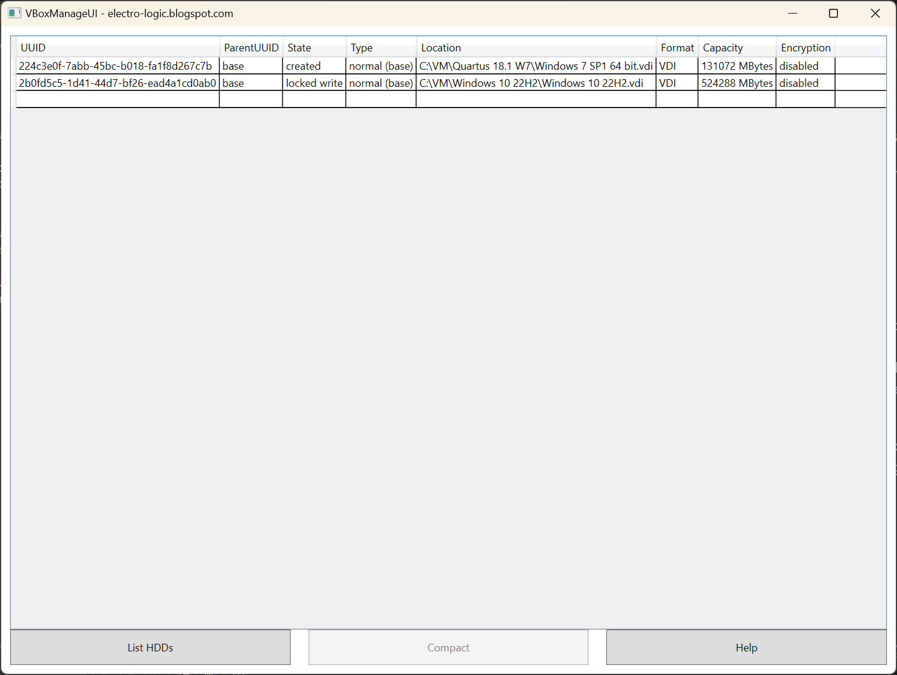

# VBoxManageUI
Simple User Interface for [VirtualBox](https://www.virtualbox.org) VBoxManage utility

This utility compact virtual disks in an easy way, to save a lot of disk space.

Before running this utility ensure that:
- The virtual disk is defragmented
- The virtual disk free space is zeroed

To zero free space run [sdelete](https://learn.microsoft.com/en-us/sysinternals/downloads/sdelete), for example "sdelete.exe c: -z" where C: is your data partition

If your Virtual Box installation is different from "C:\Program Files\Oracle\VirtualBox\VBoxManage.exe", please update the "VBoxManagePath" key in the "VBoxManageUI.exe.config" file, before running the utility.